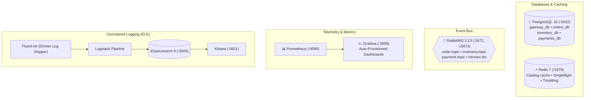

<div align="center">

# 🐳 Hermex Infrastructure Platform
### Multi-Database PostgreSQL, RabbitMQ 3.13, Redis & Full Observability Stack

[ **English** ] &nbsp;•&nbsp; [ [Українська](README.ua.md) ] &nbsp;•&nbsp; [ [System Overview](../overview/README.md) ]

<p align="center">
  Docker Compose &bull; PostgreSQL 16 (4 Isolated DBs) &bull; RabbitMQ 3.13 &bull; ELK 8 &bull; Prometheus + Grafana
</p>

</div>

> **`docker`** is the shared base infrastructure repository for Hermex.  
> It provides Docker Compose manifests for PostgreSQL 16 (with automatic provisioning of 4 isolated databases), Redis 7, RabbitMQ 3.13, the ELK logging stack (Elasticsearch 8, Logstash, Fluent-bit, Kibana), and metrics observability (Prometheus + Grafana auto-provisioning).

---

## 🏛️ Infrastructure Topology



---

## 📁 Directory Structure

```text
docker/
├── docker-compose.yml         # Shared platform infrastructure manifest
├── init.sql                   # Automated creation of 4 PostgreSQL databases
├── seed-inventory.sql         # 60 flagship products with GIN specs & i18n
├── prometheus/                # Prometheus scraper configuration
│   └── prometheus.yml
├── grafana/                   # Grafana auto-provisioning
│   ├── dashboards/            # Pre-configured Observability dashboard
│   └── provisioning/          # Prometheus datasource configuration
├── logstash/                  # JSON log parsing pipeline
└── fluent-bit/                # Docker container log forwarder
```

---

## 🚀 Quickstart

### 1. Environment Setup
```bash
cp .env.example .env
```

### 2. Launch Platform Containers
```bash
docker compose up -d
```

### 3. Seed Catalog Data
Populate 60 flagship devices (Apple, Samsung, Asus, Dell, Sony) directly into PostgreSQL:
```bash
docker exec -i hermex-postgres psql -U hermex -d inventory_db < seed-inventory.sql
```

---

## 📊 Management Endpoints

| Service | Port | URL | Credentials |
| :--- | :---: | :--- | :--- |
| **RabbitMQ Management** | `15672` | [http://localhost:15672](http://localhost:15672) | `guest` / `guest` |
| **Grafana Dashboards** | `3000` | [http://localhost:3000](http://localhost:3000) | `admin` / `admin` |
| **Prometheus Telemetry** | `9090` | [http://localhost:9090](http://localhost:9090) | Public |
| **Kibana Log Viewer** | `5601` | [http://localhost:5601](http://localhost:5601) | Public |
| **PostgreSQL 16** | `5432` | `localhost:5432` | `hermex` / `hermex_secret_pwd` |
| **Redis 7** | `6379` | `localhost:6379` | No password (dev) |

---

## 🐘 Database Provisioning (`init.sql`)

On container initialization, `init.sql` automatically executes:
```sql
CREATE DATABASE gateway_db;
CREATE DATABASE orders_db;
CREATE DATABASE inventory_db;
CREATE DATABASE payments_db;
```
Each service operates **strictly against its assigned database**, enforcing Database-per-Service boundaries.
