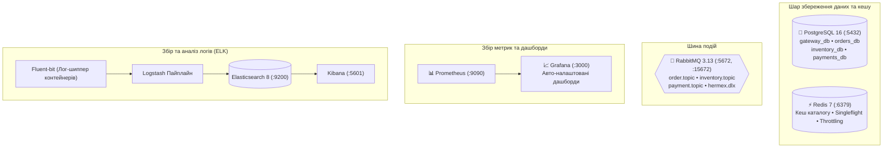

<div align="center">

# 🐳 Базова інфраструктура Hermex
### Multi-DB PostgreSQL, RabbitMQ 3.13, Redis та повна система спостережуваності

[ [English](README.md) ] &nbsp;•&nbsp; [ **Українська** ] &nbsp;•&nbsp; [ [Головний огляд](../overview/README.ua.md) ]

<p align="center">
  Docker Compose &bull; PostgreSQL 16 (4 ізольовані БД) &bull; RabbitMQ 3.13 &bull; ELK 8 &bull; Prometheus + Grafana
</p>

</div>

> **`docker`** — репозиторій спільної базової інфраструктури платформи Hermex.  
> Містить маніфести Docker Compose для PostgreSQL 16 (з авто-ініціалізацією 4 ізольованих БД), Redis 7, брокера RabbitMQ 3.13, стеку логування ELK (Elasticsearch 8, Logstash, Fluent-bit, Kibana) та системи моніторингу (Prometheus + авто-налаштована Grafana).

---

## 🏛️ Топологія інфраструктурного стеку



---

## 📁 Структура директорії

```text
docker/
├── docker-compose.yml         # Маніфест запуску базової інфраструктури
├── init.sql                   # Автоматичне створення 4 баз даних PostgreSQL
├── seed-inventory.sql         # 60 флагманських товарів зі специфікаціями GIN та i18n
├── prometheus/                # Конфігурація скрапера Prometheus
│   └── prometheus.yml
├── grafana/                   # Авто-налаштування Grafana
│   ├── dashboards/            # Предналаштований дашборд Observability
│   └── provisioning/          # Авто-підключення джерела даних Prometheus
├── logstash/                  # Пайплайн парсингу JSON-логів
└── fluent-bit/                # Лог-шиппер контейнерів Docker
```

---

## 🚀 Швидкий запуск

### 1. Налаштування середовища
```bash
cp .env.example .env
```

### 2. Запуск контейнерів
```bash
docker compose up -d
```

### 3. Наповнення каталогу товарів
Завантаження 60 пристроїв (Apple, Samsung, Asus, Dell, Sony) безпосередньо в PostgreSQL:
```bash
docker exec -i hermex-postgres psql -U hermex -d inventory_db < seed-inventory.sql
```

---

## 📊 Панелі керування

| Сервіс | Порт | URL | Логін / Пароль |
| :--- | :---: | :--- | :--- |
| **RabbitMQ Management** | `15672` | [http://localhost:15672](http://localhost:15672) | `guest` / `guest` |
| **Grafana Dashboards** | `3000` | [http://localhost:3000](http://localhost:3000) | `admin` / `admin` |
| **Prometheus Telemetry** | `9090` | [http://localhost:9090](http://localhost:9090) | Публічний |
| **Kibana Log Viewer** | `5601` | [http://localhost:5601](http://localhost:5601) | Публічний |
| **PostgreSQL 16** | `5432` | `localhost:5432` | `hermex` / `hermex_secret_pwd` |
| **Redis 7** | `6379` | `localhost:6379` | Без паролю (dev) |

---

## 🐘 Створення баз даних (`init.sql`)

При ініціалізації контейнера `init.sql` автоматично виконує:
```sql
CREATE DATABASE gateway_db;
CREATE DATABASE orders_db;
CREATE DATABASE inventory_db;
CREATE DATABASE payments_db;
```
Кожен сервіс взаємодіє **виключно зі своєю базою**, реалізуючи стандарт Database-per-Service.
